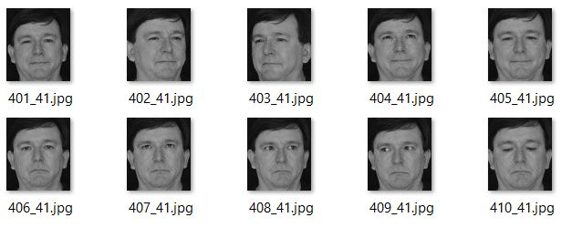
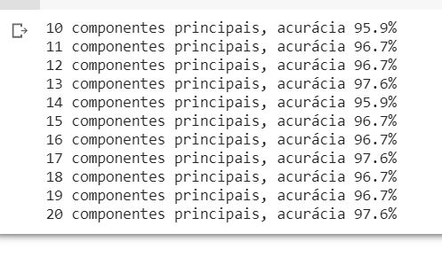
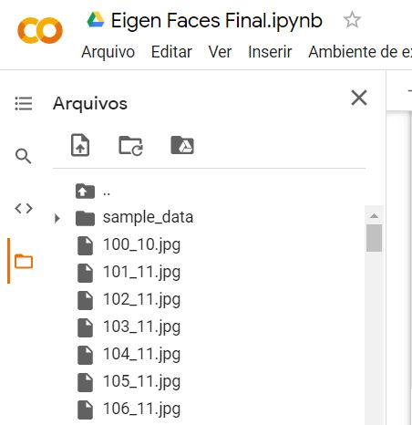

## FURB - Curso de Especialização em Data Science  - Turma 2
## Disciplina de Aprendizado de Máquina II - Aprendizado Não Supervisionado
### Professor Mácio Koch
### Trabalho avaliativo 
### Aluno: Mauro Schramm
-------------------

### Descrição Geral

O trabalho foi desenvolvido na linguagem Python a partir do exemplo em Java desenvolvido pelo professor em aula. Trata-se da aplicação da técnica de **análise das componentes principais** (**PCA**, na sigla em inglês) através da biblioteca de visão computacional **OpenCV**. Não foi realizada uma nova implementação do algoritmo da PCA. 

O programa utiliza uma base imagens conhecida como **ORL**, adicionada de algumas imagens produzidas pelo autor deste trabalho, conforme figura abaixo.

Imagens adicionadas à base ORL:

[Enunciado do trabalho](./aux/enunciado.pdf)

[Implementação](./Eigen_Faces_Final.ipynb)

[Implementação no Google Colab (link somente leitura)](https://colab.research.google.com/drive/13fHKoLPvKiY-0WNzVG17Su20QaH6j5qy?usp=sharing)

--------------

### Exemplo de execução
A figura abaixo apresenta a saída gerada pelo programa em uma execução
 

-----------------

### Instruções para execução

1. Abra o arquivo com o código do programa [Eigen_Faces_Final.ipynb](./Eigen_Faces_Final.ipynb) e clique no ícone 

   Isto abrirá um *notebook* no Google Colab com uma célula contendo o programa;
2. Baixe o arquivo com a imagens [images.zip](./images.zip), descompate-o e carregue os arquivos de imagem para a pasta raiz do sistema de arquivos do notebook recém aberto no Colab (conforme figura abaixo);
3. Execute a célula de código no Colab.

Arquivos de imagens no projeto do Google Colab:

